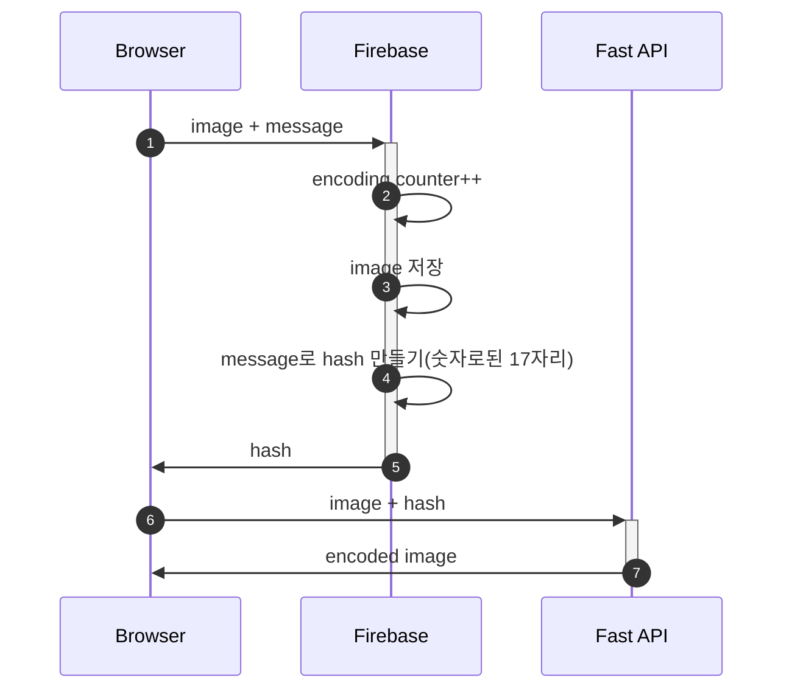
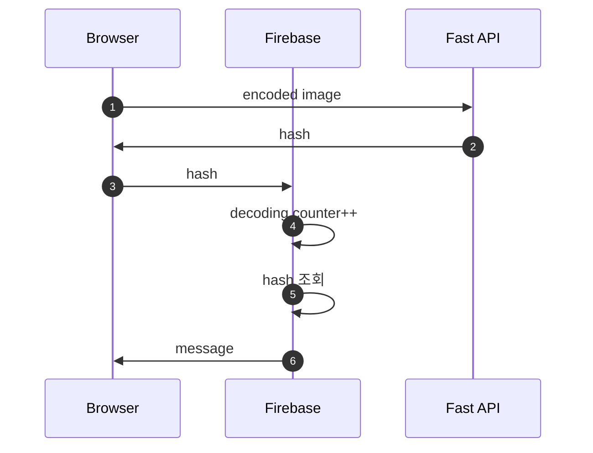

# Aurastamp Model API

## Setup

```sh
# Mac OS
python3 -m venv .venv
source .venv/bin/activate
pip install --upgrade pip
pip3 install --requirement requirements.txt

# download predefined models

gdown -O ./predefined_models/encoder.pth https://drive.google.com/uc?id=1IDihrN8OwRp7YV-pHDOz82oA7b3tpMKj
gdown -O ./predefined_models/decoder.pth https://drive.google.com/uc?id=1gKIYa9Xj-N-fbINHdUXe0tEof7fwe2x8

python3 app/main.py
# or
python3 -m uvicorn app.main:app --reload
# or just press F5 at main.py in VSCode
```

```sh
# setup local development environment using docker

# freeze requirements
pip freeze >requirements.txt

# build docker image
docker build -t aurastamp .

# run docker container
# --rm flag means that clean all artifacts up when container is down
docker run -it --rm -p 8000:8000 aurastamp
```

### Encoding process



### Decoding process


